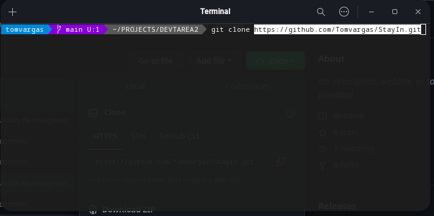
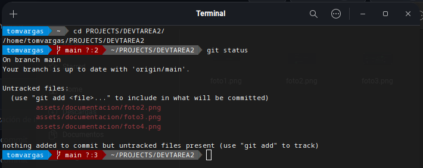
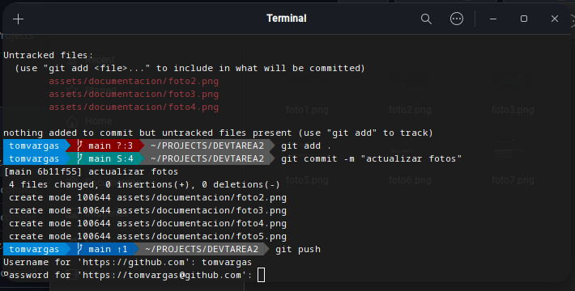
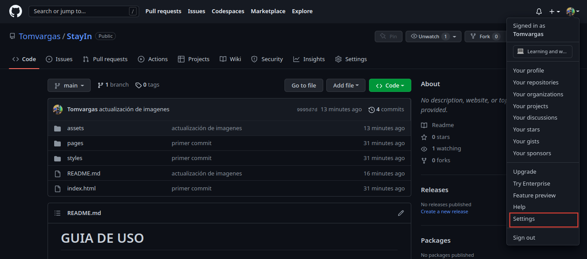
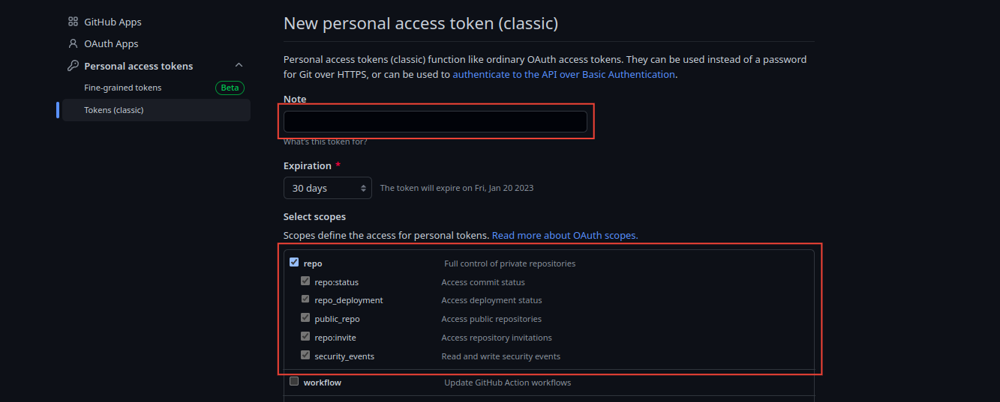
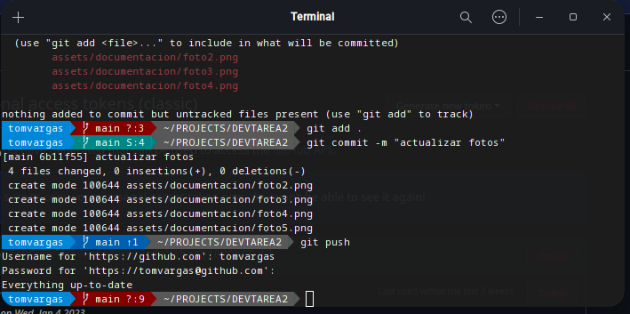
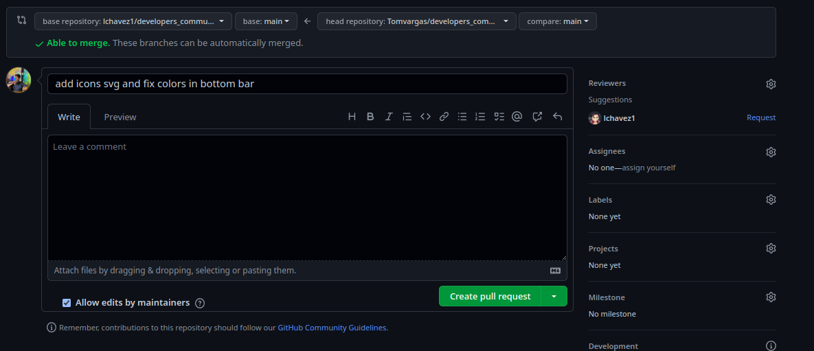

# GUIA DE USO
## 1. Usa Git
Primero debes instalar git en tu pc, para hacerlo debes ir a [este link](https://git-scm.com/downloads), instala el que necesite tu computadora.
Abre tu terminal, puede ser CMD en windows y sigue estos pasos para configurarlo.
1) Configura tu nombre:
    > $ git config --global user.name "Tu Nombre"

2) Configura tu correo:
    > $ git config --global user.email tu@mail.com

Para el proyecto debes saber estos comandos básicos de Git:

* Clona un repositorio a tu computadora
    > $ git clone "URL"

* Revisa el estatus de tu proyecto
    > $ git status

* Agrega los cambios a tu rama
    Agrega un archivo
    > $ git add "nombre_del_archivo.ext"
    
    Agrega todo a tu rama
    > $ git add .

* Luego de agregar tus cambios a la rama debes crear un commit (Cuando Creas un commit se agrega un log a todos los archivos agregados a tu rama)
    > $ git commit -m "mensaje de cambios"

* Sube los cambios a tu repositorio
    > $ git push

## 2. Usa este repo
Primero debes crear un Fork en GitHub:

Luego verás este repositorio como tuyo en Github, Vamos a clonarlo a tu PC Local

Abre tu consola, puede ser CMD en windows y usamos los siguientes comandos:
Dirigete a la ruta donde quieres que esté tu proyecto con el comando **cd**

Usa el comando **git clone** para clonar el repo
> $ git clone "url que copiaste de github"
**ejemplo:**

Por último usa de nuevo el comando cd para entrar a la carpeta de tu proyecto clonado
> $ cd StayIn

Una vez ahí puedes comenzar a editar tu parte, recuerda no alterar la estructura, solo edita tu parte.

Cuando termines de editar algo significativo puedes subirlo a la rama de tu repositorio clonado en GitHub

Sigue estos pasos:

> $ git status

> $ git add .

> $ git commit -m "mensaje"

> $ git push

Cuando ejecutes **git push** Te pedira iniciar sesión desde la consola, ingresa tu nombre de usuario de GitHub y en contraseña debes obligatoriamente seguir estos pasos:

Solo pegamos la clave generada en la terminal, (no se visualizará nada pero solo se debe dar enter), listo, se subirán tus cambios a GitHub

Solo queda un proceso más

## Crea un Pull request para juntar tu parte al proyecto
Hasta este punto solo tienes tus cambios para ti, pero no está todo junto.

Solo en tu repositorio tendrás esta barra, Lo que debes hacer es entrar a Contribute y luego en la opción **Open pull Request**

Se abrirá una página donde puedes dejar un mensaje justificando o indicando los cambios que hiciste y luego en el botón verde para crearlo.
Listo, este proceso puedes hacerlo todas las veces que quieras, Yo lo revisaré y si hay algún error o cambio en la estructura puedo dejarte un mensaje indicando en que parte te equivocaste antes de combinar tu repositorio con este repo principal.